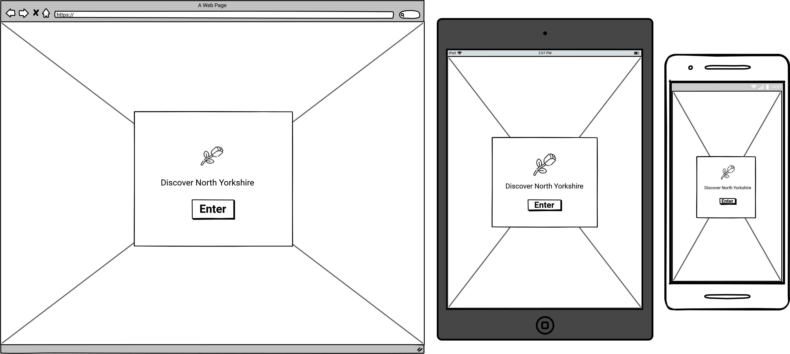

# Discover North Yorkshire

## Code Institute - Milestone Project 2

## UX:

## Design:

### Colour Scheme

### Typography

The primary font I have chosen for my project is *Sansita Swashed* and the secondary font I have selected is *Roboto*. 
The secondary font is used if there are any issues presenting the primary font.
The fonts were both taken from [Google-Fonts](https://fonts.google.com/specimen/Sansita+Swashed?query=sansita+s#standard-styles).

### Imagery

## Wireframes:

* Splash Page:

## Features:

## Technology used:

### Programming Languages

* [HTML5](https://en.wikipedia.org/wiki/HTML5)
* [CSS3](https://en.wikipedia.org/wiki/CSS)
* [Javascript](https://en.wikipedia.org/wiki/JavaScript)

## Testing:

## Deployment:

## Credits:

### Code

### Content

### Media used

* Hardraw Force image used on the website splash-page is by Obsidain Photography from [Pixabay](https://pixabay.com/photos/hardraw-force-waterfall-cliff-drop-1067170/).
* North Yorkshire Dales hero image used on the home-page is by Kevinsphotos from [Pixabay](https://pixabay.com/photos/yorkshire-moors-dales-yorkshire-1649463/).