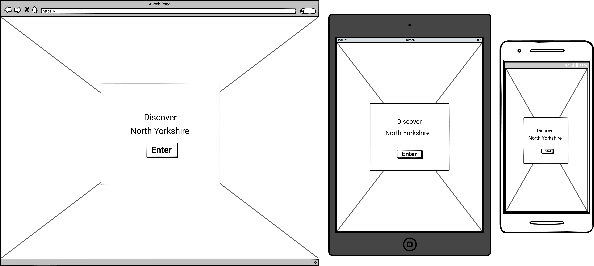
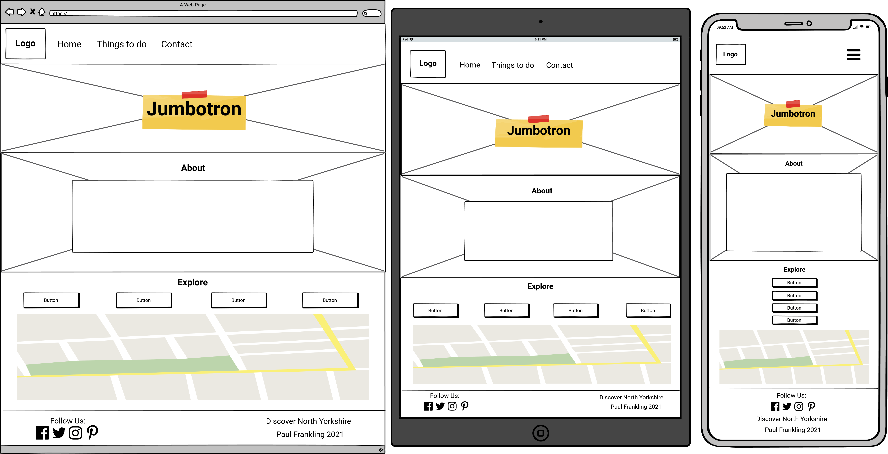
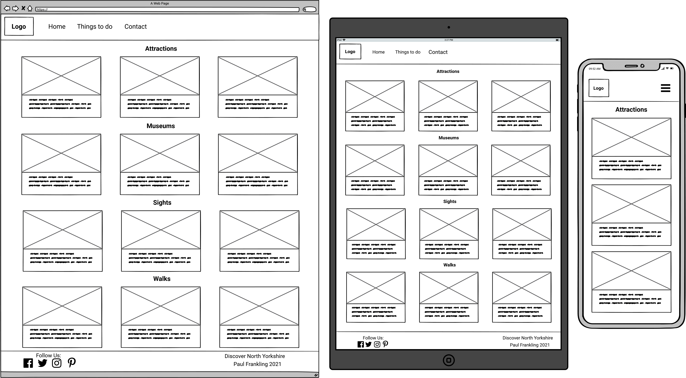

# Discover North Yorkshire

## Code Institute - Milestone Project 2

[Click here to view my website](https://paulfrankling.github.io/discover-north-yorks/)

## UX:

## Design:

### Colour Scheme

### Typography

The primary font I have chosen for my project is *Sansita Swashed* and the secondary font I have selected is *Roboto*. 
The secondary font is used if there are any issues presenting the primary font.
The fonts were both taken from [Google Fonts](https://fonts.google.com/specimen/Sansita+Swashed?query=sansita+s#standard-styles).

### Imagery

## Wireframes:

* Splash Page:

* Home Page:

* Things to do Page:

## Features:

## Technology used:

### Programming Languages

* [HTML5](https://en.wikipedia.org/wiki/HTML5)
* [CSS3](https://en.wikipedia.org/wiki/CSS)
* [Javascript](https://en.wikipedia.org/wiki/JavaScript)

### Frameworks, Libraries and Programs

1. [Bootstrap](https://getbootstrap.com/docs/4.5/getting-started/introduction/) - is used to make the website responsive as well as form the layout and add components to the page.
1. [Google Fonts](https://fonts.google.com/specimen/Sansita+Swashed?query=sansita#pairings) - is used to implement *Sansita-Swashed* to my style.css and *Roboto* for the buttons and CTA's.
1. [Flaticon](https://www.flaticon.com/) - was used to select and edit the logo of the website.
1. [Pine Tools](https://pinetools.com/) - was used to resize the images on the Things to do page to the same size as each other.
1. [TinyPNG](https://tinypng.com/) - was used to decompress the imagery on the website to improve the speed of the website.

## Testing:

## Deployment:

### GitHub Pages

This project was deployed to GitHub Pages by doing the following:

1. Sign in to GitHub and locate the GitHub Repository.
1. Select "Settings" from the menu above the Repository files.
1. Scroll down to the "GitHub Pages" section.
1. Under "Source" click the dropdown menu called "None" and select "Master Branch".
1. After selecting "Master Branch", the page will automatically refresh.
1. The website is now deployed. Return to the "GitHub Pages" section to retrieve the newly published link.

### Forking the GitHub Repository

1. Sign in to GitHub and locate the GitHub Repository.
1. Go to the top right side of the screen and below the navigation bar is the "Fork" button.
1. After clicking this, you will now have a copy of the original Repository in your GitHub account.

### Making a Local Clone

1. Sign in to GitHub and locate the Repository.
1. Above the Repository files, click on the "Code" button.
1. You are then met with three options, HTTPS, SSH and GitHub CLI. Select one and copy the URL.
1. Open Git Bash.
1. Now change the current working directory to the location you'd like the cloned directory to be made.
1. Type `Git Clone` and then paste the URL copied from step 3.
1. Press Enter. Your local clone will now be created. 

## Credits:

### Code

* [Snazzy-Maps](https://snazzymaps.com/style/47/nature) was used to style the google-maps API.
* [CSS Tricks](https://css-tricks.com/quick-css-trick-how-to-center-an-object-exactly-in-the-center/) was used to place the title in the middle of the screen on my splash page.
* [CSS Scan](https://getcssscan.com/css-box-shadow-examples) was used to choose and apply a box-shadow to the boxes on the webpage.

### Content

* [North York Moors National Park](https://www.northyorkmoors.org.uk/visiting/see-and-do/attractions/dalby-forest) - This was used to write information on the card of Dalby Forest on the Things to do page.

### Media used

* Hardraw Force image used on the website splash-page is by Obsidain Photography from [Pixabay](https://pixabay.com/photos/hardraw-force-waterfall-cliff-drop-1067170/).
* North Yorkshire Dales hero image used on the home-page is by Kevinsphotos from [Pixabay](https://pixabay.com/photos/yorkshire-moors-dales-yorkshire-1649463/).

#### Things to do page image credits

* Dalby Forest image is by Luke Porter from [Unsplash](https://unsplash.com/photos/DnP-gG1Qg8o).
* Piglets generic image used for Piglets Adventure is by Christopher Carson from [Unsplash](https://unsplash.com/photos/i4XLJmlYit4).
* North York Moors Railway image is by Lisa Baker from [Unsplash](https://unsplash.com/photos/oBFSFAH7sYw).
* Eden camp image is by Vicki Roberts from [Pixabay](https://pixabay.com/photos/signs-world-war-1-world-war-2-2249564/)
* Cows generic image used for James Herriot Museum is by PublicDomainPictures from [Pixabay](https://pixabay.com/photos/england-north-yorkshire-cow-cows-70714/).
* Castle Howard image is by Pexels from [Pixabay](https://pixabay.com/photos/castle-castle-howard-england-1845978/).
* Ribblehead Viaduct is by 12019/10259 images from [Pixabay](https://pixabay.com/photos/ribblehead-viaduct-yorkshire-england-1748638/).
* Whitby Abbey image is by Michaela Wenzler from [Pixabay](https://pixabay.com/photos/whitby-abbey-ruin-monastery-4537154/).
* Aysgarth Falls image is by Postbyte from [Pixabay](https://pixabay.com/photos/yorkshire-dales-aysgarth-falls-1100943/).
* Brimham Rocks image is by Martina Backes from [Pixabay](https://pixabay.com/photos/stones-rock-rock-formation-4529985/).
* Malham Cove image is by Tim Hill from [Pixabay](https://pixabay.com/photos/limestone-causeway-malham-2451396/).