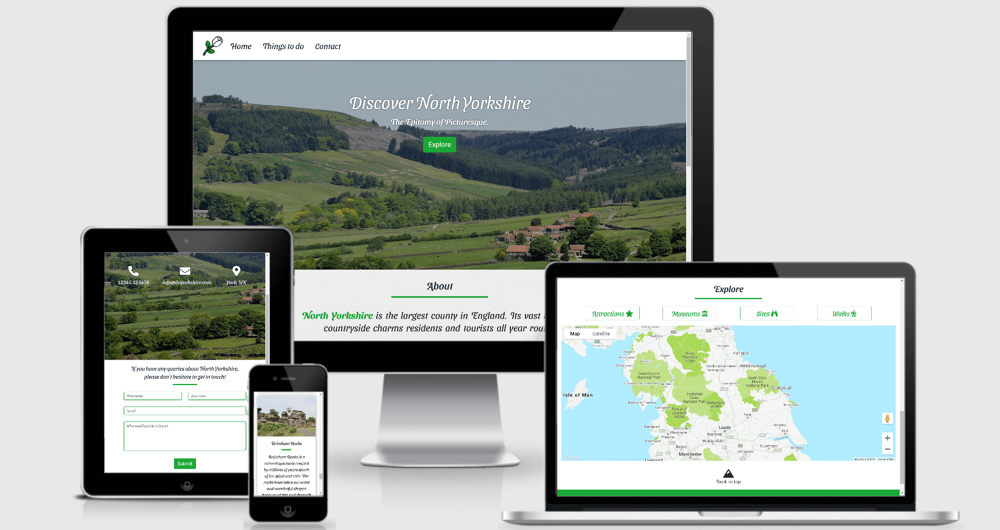
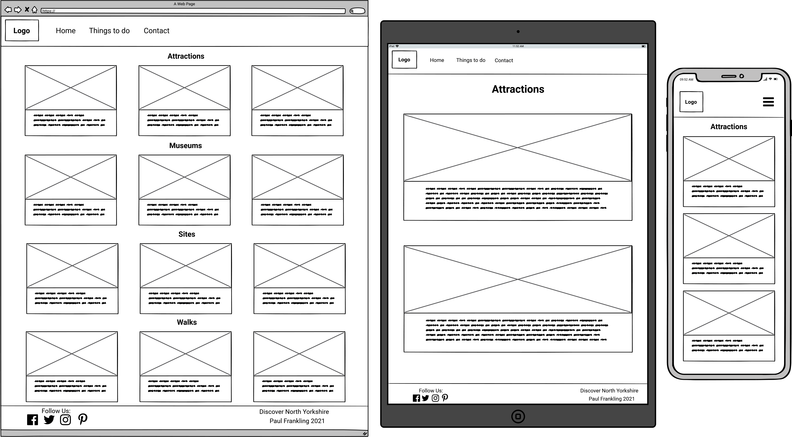
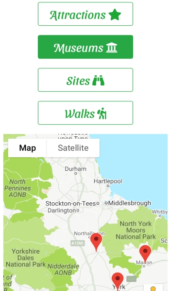

# Discover North Yorkshire

## Code Institute - Milestone Project 2

[Click here to view my website](https://paulfrankling.github.io/discover-north-yorks/)

This website has been designed to encourage users to visit the county of North Yorkshire. Discover North Yorkshire is targeted at tourists and vacationers, as well as residents of the county. 
The primary goal of the website is to attract people to visit the county through the use of the Google Maps API, showing the exact location, as well as providing detailed information for each location on a separate page. 
By also inputting a contact form on the website, visitors can contact the site with any potential query.

## User Experience(UX):

  * ### User Stories
     
    * #### First Time Visitor Goals
      * As a First Time Visitor, I want to understand the purpose of the website and view what North Yorkshire has to offer.
      * As a First Time Visitor, I want to navigate throughout the website easily to find content.
      * As a First Time Visitor, I would like to be able to view the map and see where and what types of activities there are presented.

    * #### Returning Visitor Goals
      * As a Returning Visitor, I would like to further educate myself on each location or the location I am interested in visiting on the **Things to do page**.
      * As a Returning Visitor, I would like to contact the administrators with any general queries or questions about visiting North Yorkshire. 

    * #### Frequent User Goals
      * As a Frequent User, I would like to see if any new locations have been added to the website.
      * As a Frequent User, I would like to view the different social media accounts to either view, look for new updates or potentially interact with other people involved in the public forums.
      * As a Frequent User, I would like to revert back to the map to plan a journey or use it for map-reading whilst travelling in North Yorkshire.

## Design:

### Colour Scheme

The colour scheme used for this website was composed through the use of [Coolor](https://coolors.co/ffffff-f5b700-1aa735-12854a-16262e).

* White `#FFFFFF`
* Orange Yellow `#F5B700`
* Green Pantone `#1AA735`
* Sea Green `#12854A`
* Gunmetal `#16262E`

### Typography

The primary font I have chosen for my project is *Sansita Swashed* and the secondary font I have selected is *Roboto*. 
The secondary font is used if there are any issues presenting the primary font.
The fonts were both taken from [Google Fonts](https://fonts.google.com/specimen/Sansita+Swashed?query=sansita+s#standard-styles).

### Imagery

The logo was selected and edited on [Flaticon](https://www.flaticon.com/). The logo is an adaptation of the White Rose of York, which is now better known for representing Yorkshire.

[Pixabay](https://pixabay.com/) was used to establish a full page image on the **Splash page** and a hero image on the **Home page** and **Contact page**. It was also used to input an image of a snowy landscape to the about section on the **Home page**.

[Pixabay](https://pixabay.com/) and [Unsplash](https://unsplash.com/) was used to input images in the **Things to do page** to help put an image to each description of a location.  

## Wireframes:

* Splash Page:

* Home Page:

* Things to do Page:

* Contact Page:

## Features:

### Splash page

I have added a Splash page to the webpage to give the user a welcome introduction to the site with a lovely image of Hardraw Force waterfall.
There is also a CTA button to enter the website.

### Home page

On the home page, the user is met with a responsive navigation bar with the website logo to the left, which is an adapted version of the White Rose of York.
Just below that is a hero image and jumbotron with the website title and slogan. There is also a CTA button that takes the user straight to the map. Below that is the about section, which gives a brief overview of North Yorkshire.
Between the hero image, jumbotron and about section; I wanted to make the idea of visiting North Yorkshire very appealing.

#### Google Map API

The map added is used to demonstrate 12 must visit locations in North Yorkshire to the user. I have split the locations into four categories; Attractions, Museums, Sites and Walks.
I gave each category three locations and manually added markers for each location in Javascript. Each marker has an info window which shows when the user clicks the marker and they all present a link to their respective card in the **Things to do page**.
The buttons above the map have been linked to the map with the use of jQuery. The markers show when a map button is clicked and removes the previous markers when a different one is clicked. 
I styled the map with [Snazzy-Maps](https://snazzymaps.com/style/47/nature) to try fit with colour scheme of the predominant green and white.

### Things to do page

This page presents a card for each location and the cards show an image, title and description. Each image on this page was shortened to 500 x 350 pixels with the use of [Pine Tools](https://pinetools.com/) to make each card image the same size.
This page is used as an information page for the user to get a better understanding of the location behind the marker on the **Home page** map.

### Contact page

This page was designed to give the user chance to contact the administration with any questions. This page presents the same hero image as the **Home page** but instead of a jumbotron, presents the websites contact details (Which are fake for the purpose of the project).
The contact form is linked to an email address through the use of [EmailJS](https://www.emailjs.com/). The contact form has an added Media Query in order to retain a sensible width on larger screen sizes. The use of `required` tells the user to input details correctly in each field where applicable.
There is also a submit button for the user below the form too.

### Features throughout the website

The navigation bar takes the user to the **Home page**, **Things to do page** and **Contact page**. The logo on the navigation bar also takes the user to the **Home page**.
I have placed a 'Back to top' button on each page to ensure the user doesn't have to manually scroll to the top when they reach the bottom of the page. I have used a mountain icon to fit the hilly landscape that North Yorkshire possesses.
The button was established through the use of Javascript and uses a smooth scroll to keep the user oriented when returning to the top of the page.

The footer on each page presents four social media icons in which the user can interact with. The icons take the user to their respective social media site. They open up on a new tab so the user doesn't lose this website.
I have also placed the title of the webpage and copyright information on the footer.
The navigation bar links, back to top button and social media icons all turn to Orange Yellow `#F5B700` when hovered over by the user.

## Issues Overcome:

#### Issue 1

I had an issue with the cards keeping to an equal height on the **Things to do page** when changing screen size as shown in the image below:

I searched for a solution to the problem on [Stack Overflow](https://stackoverflow.com/questions/35868756/how-to-make-bootstrap-4-cards-the-same-height-in-card-columns) and found that `d flex align-items-stretch` kept the cards equal heights when changing screen size regardless of the volume of content.

#### Issue 2

I thought the boxes on the **Things to do page** looked very long on medium sized screens such as iPads:

I corrected this by changing `col-md-4` to `col-lg-4` so the UX wasn't jeopardised on medium sized screens.

#### Issue 3

I had trouble with the design process of the **Home page** and specifically the about section:

I felt the design of the about section was very plain and not appealing to the user. I decided to remove the boxes and place subtle imagery in the background.

## Technology used:

### Programming Languages

* [HTML5](https://en.wikipedia.org/wiki/HTML5)
* [CSS3](https://en.wikipedia.org/wiki/CSS)
* [Javascript](https://en.wikipedia.org/wiki/JavaScript)

### Frameworks, Libraries and Programs

1. [Bootstrap](https://getbootstrap.com/docs/4.5/getting-started/introduction/) - is used to make the website responsive as well as form the layout and add components to the page.
1. [Google Fonts](https://fonts.google.com/specimen/Sansita+Swashed?query=sansita#pairings) - is used to implement *Sansita-Swashed* to my style.css and *Roboto* for the buttons and CTA's.
1. [Flaticon](https://www.flaticon.com/) - was used to select and edit the logo of the website.
1. [Pine Tools](https://pinetools.com/) - was used to resize the images on the **Things to do page** to the same size as each other.
1. [TinyPNG](https://tinypng.com/) - was used to compress the imagery on the website to improve the speed of the website.
1. [Coolor](https://coolors.co/ffffff-f5b700-1aa735-12854a-16262e) - was used to assemble the colour scheme of the website.
1. [Balsamiq](https://balsamiq.com/wireframes/desktop/) - was used to create the wireframes for the project.
1. [Font Awesome](https://fontawesome.com/) - was used to apply social media icons on the webpage footer and icons for the webpage 'contact details' in the contact section.
1. [Hover.css](https://ianlunn.github.io/Hover/) - was used on my navigation bar links and social media links. This changes colour of the link when hovered over.
1. [jQuery](https://jquery.com/) was used to stop the contact increasing fully on a larger screen and helped with marker interaction on the Google Maps API.
1. [EmailJS](https://www.emailjs.com/) was used to establish a link between the contact form and an email address.
1. [Google Maps API](https://developers.google.com/maps/documentation/javascript/overview) was used to input an interactive map on the webpage.
1. [Autoprefixer](https://autoprefixer.github.io/) was used to add web prefixes to the css in order for it to render properly on all browsers.
1. [Am I Responsive?](http://ami.responsivedesign.is/) was used to create a mockup of the website for the README.md.
1. [Git](https://git-scm.com/) - was used for version control. It was through the terminal Gitpod in which code was committed and pushed to GitHub.
1. [GitHub](https://github.com/) - was used to store the project pushed from Git.

## Testing:

### Validation

* [W3C Markup Validation](https://validator.w3.org/#validate_by_uri) was used to validate the code in the four HTML files.
* [W3C CSS Validation](https://jigsaw.w3.org/css-validator/#validate_by_uri) was used to validate the code in my *style.css* file.
* [JShint](https://jshint.com/) was used to validate the JS in each of my three JS files.

### Testing of User Stories in UX section:
     
  * #### First Time Visitor Goals
    
    * As a First Time Visitor, I want to understand the purpose of the website and view what North Yorkshire has to offer.

      1. The user is met with a simple **Splash page** and then upon entering the site to the **Home page**, they are met with a clear navigation bar giving the user an option of three pages.
      1. The about section details the purpose of the webpage by persuading the user to visit North Yorkshire and informing them about the county.

    * As a First Time Visitor, I want to navigate throughout the website easily to find content.

      1. The user is able to navigate easily around the website with the use of the navigation bar. The logo also contains a link back to the **Home Page**.

    * As a First Time Visitor, I would like to be able to view the map and see where and what types of activities there are presented.

      1. Upon entering the website, the user is met with a CTA button which takes the user to the map. 
      The user can easily choose between four categories with the use of buttons, which show their respective markers on the map.
      1. An info window for each marker appears for each location and details the name, title and a link to its **Things to do page** card.

  * #### Returning Visitor Goals

    * As a Returning Visitor, I would like to further educate myself on each location or the location I am interested in visiting on the **Things to do page**.

      1. The **Things to do page** is easily accessible through the navigation bar and gives the user information on each location demonstrated on the map.
      1. Each card on the page presents an appealing and relevant image to its location as well as useful information on each place to further intrigue the user to visit North Yorkshire.

    * As a Returning Visitor, I would like to contact the administrators with any general queries or questions about visiting North Yorkshire.

      1. The user can easily access the contact page through the navigation bar and can fill the contact form and submit it to its linked EmailJS account.
      1. There is also a phone number and email address deployed on the **Contact page** to offer the user another form of contact.

  * #### Frequent User Goals

    * As a Frequent User, I would like to see if any new locations have been added to the website.

      1. The user can return to the website to see if any locations have been added to the map and **Things to do page**.

    * As a Frequent User, I would like to view the different social media accounts to either view, look for new updates or potentially interact with other people involved in the public forums.

      1. The user can access social media accounts displayed in the footer. The links take the user to a new page to view the social media accounts whilst retaining this website on the previous tab.

    * As a Frequent User, I would like to revert back to the map to plan a journey or use it for map-reading whilst travelling in North Yorkshire.

      1. The user can return to the site frequently to look at the map and seek its location easily from the use of the markers and its respective info window. 
      This can either be to plan a journey or visit whilst in North Yorkshire.

### Further Testing

#### I have tested the website on the following internet browsers:

* Google Chrome
* Microsoft Edge
* Safari
* Internet Explorer
* Firefox

#### I have tested the website on the following devices:

* ASUS Zenbook 14 UX434
* iPhone 7
* iPhone X
* iPad
* Huawei P Smart
* Acer Laptop

#### Testing process:

At the beginning, I asked friends and family members to test my website on their device as well as ask for their opinion on any issues.

The below table represents each aspect I focused on testing and the device type tested on:

##### Table Key:

&check; - *Works*, &cross; - *Doesn't Work*.

| Item tested | iPhone X | iPhone 7 | iPad | Huawei P30 lite | Acer Laptop | Asus Zenbook 14 UX434 |
| ----------- | -------- | -------- | ---- | --------------- | ----------- | --------------------- |
| Splash page Enter button   | &check; | &check; | &check; | &check; | &check; | &check; |
| Navbar links               | &check; | &check; | &check; | &check; | &check; | &check; |
| Home page CTA              | &check; | &check; | &check; | &check; | &check; | &check; |
| Smooth scroll behaviour    | &cross; | &cross; | &cross; | &check; | &check; | &check; |
| Map buttons                | &check; | &check; | &check; | &check; | &check; | &check; |
| Map load                   | &check; | &check; | &check; | &check; | &check; | Not Always |
| Map markers                | &check; | &check; | &check; | &check; | &check; | &check; |
| Social links               | &check; | &check; | &check; | &check; | &check; | &check; |
| Contact form               | &check; | &check; | &check; | &check; | &check; | &check; |
| Contact form submit button | &check; | &check; | &check; | &check; | &check; | &check; |
| Contact form modal         | &check; | &check; | &check; | &check; | &check; | &check; |
| Back to top button         | &check; | &check; | &check; | &check; | &check; | &check; |
| Info Windows and links     | &check; | &check; | &check; | &check; | &check; | &check; |
| Hover colours              | &check; | &check; | &check; | &check; | &check; | &check; |
 
* The **Splash page** 'Enter' button took me straight to the **Home page** of the website with no problems on any device.
* The Navbar links as well as the logo, successfully took me to the correct page as intended.
* The **Home page** CTA 'Explore' button takes the user to the map as intended.
* The `scroll-behaviour: smooth;` fails to work on Apple products as shown above. It failed to work on Firefox, Safari and Google Chrome on my iPhone 7.
* The Map buttons worked correctly and showed the markers everytime they were clicked on, as well as removing them when a new button was clicked on.
* On my Asus Zenbook, I had noticed that when visiting my website frequently, I realised the map didn't always appear. 
  This is a minor problem, as the map always appears when the page is refreshed.
* The Map markers appeared in the correct on each device as expected.
* The Social links all work correctly on every device. They were opening on a new tab every time whilst keeping the website open on the previous tab.
* The Contact form was tested on all devices and the use of `required` was successful on each input field as a message displayed every time it was required too.
* The Contact form successfully submitted the message to my EmailJS every time tested. The page never refreshed and always cleared on form submission.
* The Contact form once submitted successfully displayed the modal. The modal can be closed by either selecting 'Okay' or the 'x' button in the top right corner of the modal.
* The Back to top button worked properly on every page.
* The Info Windows were all individually tested and each one opened up properly. Each Info Window has a link that takes the user to its appropriate card on the **Things to do page** and takes the user to the correct card.
* The Back to top button, Navbar links and Social links were all tested for their respective colour changes on hover. They all worked without problems.

### Fixed bugs

* In the validation process, the 'Enter' and 'Explore' buttons on the **Splash page** and **Home page** were producing an error that said the 'button' element
 couldn't be embedded in an 'a' element. I found the solution on [Stack Overflow](https://stackoverflow.com/questions/2906582/how-to-create-an-html-button-that-acts-like-a-link),
 which showed I needed to remove the 'button' element and add it to the class instead like this `<a href="home.html" class="button btn btn-success btn-lg">Enter</a>`. 
 Once I changed the buttons, I just needed to change the elements targeted in css and it worked exactly as I wanted.

  * Another error found in the HTML was that the `<script>` tags were outside of the `<body>` tags. I was able to easily add them just above the closing `</body>` and the error was resolved.

* At the beginning of the testing process, I quickly noticed that the interactive map buttons weren't on the same screen on small devices.
This meant that the user would have to keep scrolling up and down between interacting with the map and its buttons, which I felt was bad UX.

I used a media query to make the map buttons font-size smaller and push the buttons closer together on small device screens.
I also used a media query to target the map and make its height smaller on small device screens. This made it much easier for the user to interact between.

* I changed the map button layout on medium sized screens as having two buttons to each side didn't look as good as laying the four buttons in a row.

* One bug that kept occuring was EmailJS wasn't always sending the email to my account when the page refreshed.
I stopped the contact form from refreshing and the email was always being sent properly. But the problem I had was that the form fields didn't clear on submission of the form.
I eventually added jQuery `$('#form-reset')[0].reset();` in order for the form to clear when submitted without refreshing the page.

* Another problem I kept having with the form, was the modal would appear at any point I submitted the contact form. 
I was testing the form to make sure the required message was appearing and the modal was appearing if only the first name field was filled in. 
I added a Bootstrap modal to HTML and added jQuery `$('#mymodal').modal('show')` in order for it to pop up when the form was submitted successfully.

### Known Bugs

As mentioned before, the `scroll-behaviour: smooth;` didn't work on the apple devices that I tested the website on.

The map also doesn't appear on my ASUS Zenbook sometimes and the page needs refreshing in order for it to appear.

## Deployment:

### GitHub Pages

This project was deployed to GitHub Pages by doing the following:

1. Sign in to GitHub and locate the GitHub Repository.
1. Select "Settings" from the menu above the Repository files.
1. Scroll down to the "GitHub Pages" section.
1. Under "Source" click the dropdown menu called "None" and select "Master Branch".
1. After selecting "Master Branch", the page will automatically refresh.
1. The website is now deployed. Return to the "GitHub Pages" section to retrieve the newly published link.

### Forking the GitHub Repository

1. Sign in to GitHub and locate the GitHub Repository.
1. Go to the top right side of the screen and below the navigation bar is the "Fork" button.
1. After clicking this, you will now have a copy of the original Repository in your GitHub account.

### Making a Local Clone

1. Sign in to GitHub and locate the Repository.
1. Above the Repository files, click on the "Code" button.
1. You are then met with three options, HTTPS, SSH and GitHub CLI. Select one and copy the URL.
1. Open Git Bash.
1. Now change the current working directory to the location you'd like the cloned directory to be made.
1. Type `Git Clone` and then paste the URL copied from step 3.
1. Press Enter. Your local clone will now be created. 

## Credits:

### Code

* [Snazzy-Maps](https://snazzymaps.com/style/47/nature) was used to style the google-maps API.
* [CSS Tricks](https://css-tricks.com/quick-css-trick-how-to-center-an-object-exactly-in-the-center/) was used to place the title in the middle of the screen on my **Splash page**.
* [CSS Scan](https://getcssscan.com/css-box-shadow-examples) was used to choose and apply a box-shadow to the cards on the **Things to do page** and the contact form boxes.
* [Courses.Code Institute](https://courses.codeinstitute.net/courses/course-v1:codeinstitute+FE+2017_T3/course/) was used to apply a media query to the contact form to prevent its width increasing on larger device screens.
* [Courses.Code Institute](https://courses.codeinstitute.net/courses/course-v1:CodeInstitute+IFD101+2017_T3/course/) was used to help create and link email.js to my contact-form.
* [Stack Overflow](https://stackoverflow.com/questions/226131/how-to-disable-phone-number-linking-in-mobile-safari/) was used to prevent the number on the contact section from hyperlinking on mobiles.
* [Stack Overflow](https://stackoverflow.com/questions/35868756/how-to-make-bootstrap-4-cards-the-same-height-in-card-columns) was also used to keep each card at an equal height when changing screen size.
* [Stack Overflow](https://stackoverflow.com/questions/4323848/how-to-handle-button-click-events-in-jquery) was used to help with targeting the Google Maps buttons.
* [GitHub Project](https://github.com/shanekeran/dublin-unlocked/blob/master/assets/scripts/maps.js) Dublin Unlocked by Shane Keran helped in inspiring the clearing and showing of my map markers on click of a map button.
* [Google Maps Platform](https://developers.google.com/maps/documentation/javascript/examples/marker-remove) and [Youtube](https://www.youtube.com/watch?v=Zxf1mnP5zcw&list=LL&index=4&t=1437s) tutorials were used to help with creating markers and info windows.
* [CSS Tricks](https://css-tricks.com/how-to-make-an-unobtrusive-scroll-to-top-button/) was used to help with the creation and interactivity of the Back-to-top button on the **Home page**, **Things to do page** and the **Contact page**.

### Content

* [North Yorkshire County Council](https://www.northyorks.gov.uk/about-north-yorkshire-rural-commission) - was used to extract the fact that North Yorkshire is the largest county in England.
* [North York Moors National Park](https://www.northyorkmoors.org.uk/) - This was used to write information on the card of Dalby Forest, Moors Railway, Eden Camp, James Herriot, Castle Howard and Whitby Abbey sections on the **Things to do page**.
* [Visit York](https://www.visityork.org/explore/featured-attractions/nrm) - This was used for information on the National Railway museum card.
* [Yorkshire Dales](https://www.yorkshiredales.org.uk/) - This was used to write information on the Ribblehead Viaduct, Aysgarth Falls and Malham Cove card.
* [National Trust](https://www.nationaltrust.org.uk/) - This was used to write information on the Brimham Rocks card.

### Media used

* Hardraw Force image used on the website **Splash page** is by Obsidain Photography from [Pixabay](https://pixabay.com/photos/hardraw-force-waterfall-cliff-drop-1067170/).
* North Yorkshire Dales hero image used on the **Home page** is by Kevinsphotos from [Pixabay](https://pixabay.com/photos/yorkshire-moors-dales-yorkshire-1649463/).
* Snowy landscape image used for the background of the about section on the **Home page** is by Northern_Punkie from [Pixabay](https://pixabay.com/photos/north-yorkshire-snow-landscape-4652370/).

#### Things to do page image credits

* Dalby Forest image is by Luke Porter from [Unsplash](https://unsplash.com/photos/DnP-gG1Qg8o).
* Piglets generic image used for Piglets Adventure is by Christopher Carson from [Unsplash](https://unsplash.com/photos/i4XLJmlYit4).
* North York Moors Railway image is by Lisa Baker from [Unsplash](https://unsplash.com/photos/oBFSFAH7sYw).
* Eden camp image is by Vicki Roberts from [Pixabay](https://pixabay.com/photos/signs-world-war-1-world-war-2-2249564/)
* Cows generic image used for James Herriot Museum is by PublicDomainPictures from [Pixabay](https://pixabay.com/photos/england-north-yorkshire-cow-cows-70714/).
* Castle Howard image is by Pexels from [Pixabay](https://pixabay.com/photos/castle-castle-howard-england-1845978/).
* Ribblehead Viaduct is by 12019/10259 images from [Pixabay](https://pixabay.com/photos/ribblehead-viaduct-yorkshire-england-1748638/).
* Whitby Abbey image is by Michaela Wenzler from [Pixabay](https://pixabay.com/photos/whitby-abbey-ruin-monastery-4537154/).
* Aysgarth Falls image is by Postbyte from [Pixabay](https://pixabay.com/photos/yorkshire-dales-aysgarth-falls-1100943/).
* Brimham Rocks image is by Martina Backes from [Pixabay](https://pixabay.com/photos/stones-rock-rock-formation-4529985/).
* Malham Cove image is by Tim Hill from [Pixabay](https://pixabay.com/photos/limestone-causeway-malham-2451396/).

### Acknowledgements

* Many thanks to my Mentor, who has helped me immensely in the planning and formation of the website.
* Many thanks to Code Institute tutor support for their rapid response to any of my difficulties or queries.
* Many thanks to the Slack community for being incredibly useful and supportive. 